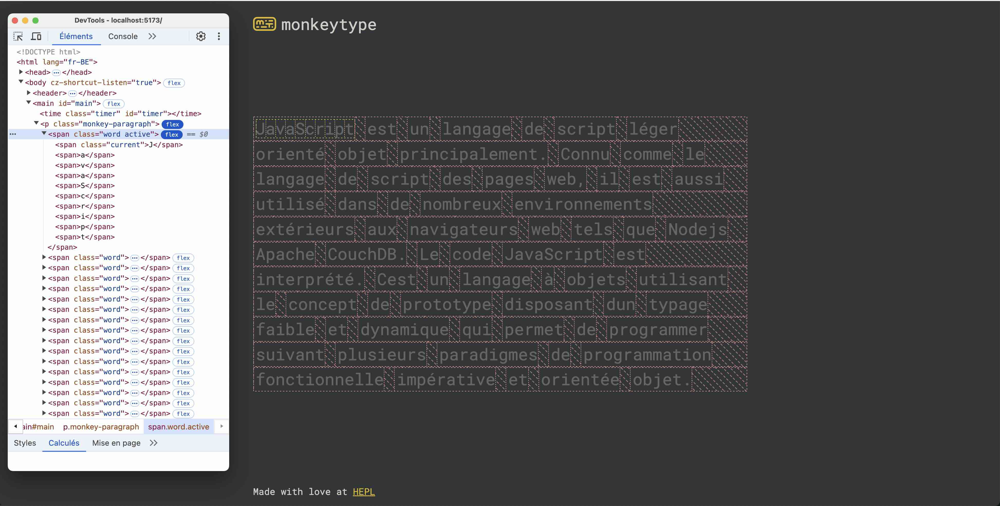
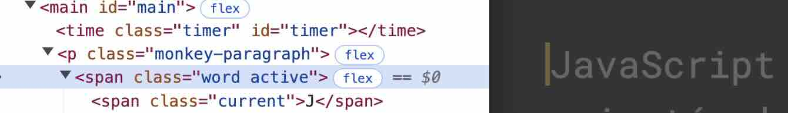

# Monkeytype

> Examen DCC — janvier 2025

## Préambule

1. Dans le cadre de cet examen de *Développement Côté Client*, vous devez uniquement vous focaliser sur les fichiers
   JavaScript. Mis à part, ajouter ou modifier une balise `script`, on ne vous demande pas de modifier le code HTML ni
   le code CSS qui s'y rapporte.
2. Cet examen dure *maximum 4 heures*.
3. Vous devez respecter [les bonnes pratiques vues en classe](https://github.com/hepl-dcc/dcc-guidelines).
4. Tous les sélecteurs CSS dont vous avez besoin (pour cibler les éléments du DOM) ainsi que les paramètres du jeu sont
   définis dans l'objet `settings` du fichier `src/js/settings.js`.
5. Vous pouvez, si vous le souhaitez, réaliser l'examen en TypeScript.

Voici la version corrigée et simplifiée de votre énoncé :

Voici une version corrigée et améliorée au format Markdown :

## Énoncé 🎯

1. **Initialisation du jeu**  
   Il vous faut les variables suivantes :
    * `currentParagraph` : Contient l'index du paragraphe actuel.
    * `currentWord` : Contient l'index du mot actuel.
    * `currentLetter` : Contient l'index de la lettre actuelle.
    * `correctLetters` : Contient le nombre de lettres correctement tapées.
    * `errorLetters` : Contient le nombre de lettres incorrectement tapées.
    * D'autres variables que vous jugerez nécessaires, notamment pour gérer le timer.  
      *(N'oubliez pas de les initialiser correctement avec des valeurs pertinentes.)*

2. **Générer les mots**  
   Dans le fichier `paragraphs.js`, vous trouverez un tableau composé de deux sous-tableaux représentant chacun un
paragraphe. Vous devez générer tous les mots *d’un seul des deux paragraphes* (le premier ou le deuxième).
    * À terme, ce choix devra être fait aléatoirement en générant un nombre entre 0 et le nombre total d’éléments dans le tableau de paragraphes. (Dans un premier temps, vous pouvez encoder ce choix en dur.)

   Voici à quoi ressemble le code HTML généré pour le premier mot du premier paragraphe :
   ```html
   <p class="monkey-paragraph">
      <span class="word">
         <span>J</span>
         <span>a</span>
         <span>v</span>
         <span>a</span>
         <span>S</span>
         <span>c</span>
         <span>r</span>
         <span>i</span>
         <span>p</span>
         <span>t</span>
      </span>
   </p>
   ```
   Chaque mot dans le tableau de mot doit être associé à une référence vers l'objet HTML qui s'y rapporte. Il en va de même pour chaque lettre.

   Pour rappel :
    * `paragraphs` : Représente une collection de paragraphes. C’est le tableau principal contenant les deux paragraphes de texte.
        * Chaque élément du tableau est un objet représentant un mot, avec les propriétés suivantes :
            * `spanWordElement` : L'élément DOM associé à ce mot.
            * `letters` : Une liste d'objets décrivant chaque lettre du mot, avec les propriétés suivantes :
                * `spanLetterElement` : L'élément DOM correspondant à cette lettre.
                * `letter` : Une chaîne de caractères contenant la valeur de la lettre, par exemple `'J'` ou `'a'`.

   
   
3. **Gérer le curseur**  
   Vous devez afficher un curseur clignotant à la fin de la lettre courante :
    * Ajoutez la classe `current` à la lettre courante.
    * Ajoutez également la classe `active` au mot courant (cette classe intervient dans le CSS pour afficher le curseur
      à la fin du mot).

   
   
4. **Gérer les événements**
   Vous devez écouter l’enfoncement des touches du clavier. Plusieurs cas de figure doivent être gérés :
    1. **Touches ignorables** :  
       Ne rien faire si la touche enfoncée est une touche *ignorable*. Pour cela, utilisez la méthode `isIgnorableKey`
       définie dans le fichier `settings.js`.
    2. **Autres touches** :
        1. Si c’est la première fois qu’une touche est enfoncée (et que le timer n’a pas encore démarré), démarrez le timer et affichez-le toutes les secondes. Notez que la baliser `#timer` est déjà présente dans le fichier HTML et attend une valeur en secondes avec la bonne valeur pour l'attribut `datetime`. Par exemple `P120S`.  
        2. Si l’utilisateur termine un mot quand on arrive au bout des lettres du mot et qu'appuie sur la barre
           d’espace :
            1. Ajoutez la classe `typed` au mot sans lui retirer la classe `active`. C'est la combinaison des classes
              `active` et `typed` permet, via CSS, d’afficher le curseur à la fin du mot.
            2. Passez au mot suivant en incrémentant `currentWord` et remettez `currentLetter` à zéro.
            3. Ajoutez la classe `active` au nouveau mot.
        3. Si l’utilisateur appuie sur la touche `Backspace` :
            1. Supprimez les classes appliquées à la lettre courante.
            2. Décrémentez `currentLetter`. Si `currentLetter` vaut zéro, remontez au mot précédent..
            3. Vérifiez qu’il ne s’agit pas de la première lettre du mot. 
        4. Si la touche correspond à la lettre attendue (
           `paragraphs[currentParagraph][currentWord].letters[currentLetter].letter`) :
            1. Ajoutez la classe `correct`.
            2. Passez à la lettre suivante en incrémentant `currentLetter`.
        5. Si la touche ne correspond pas à la bonne lettre,
            1. Ajoutez la classe `error`.
            2. Passez à la lettre suivante en incrémentant `currentLetter`.

Commencez par gérer les cas les plus simples, par exemple la gestion des bonnes et mauvaises lettres avant de gérer le passage d'un mot à l'autre et la suppression de lettre. En revanche l'ordre des étapes peut vous donner des indications sur la manière de structurer votre code.

5. **Ajouter une classe `GameState`**  
   Ajoutez une classe `GameState` pour rassembler toutes les informations représentant l’état du jeu. Cette classe doit
   contenir :
    * `currentParagraph`
    * `currentWord`
    * `currentLetter`
    * `correctLetters`
    * `errorLetters`

Cela impactera évidemment la manière d'accéder aux éléments du tableau `paragraphs`.

